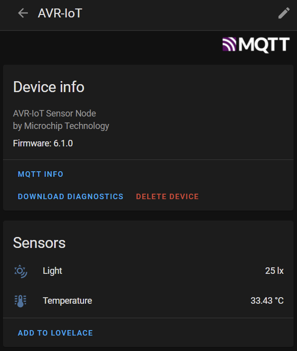
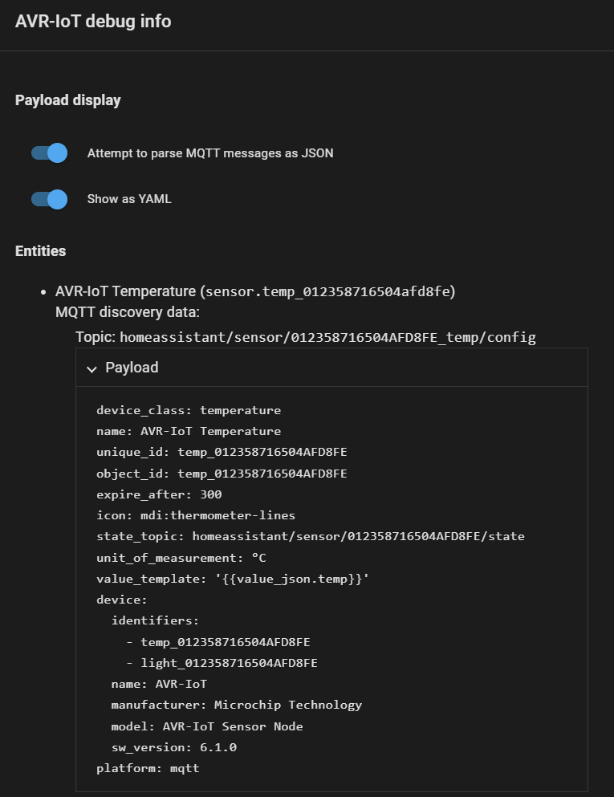

# Microchip AVR-IoT WHA (Wireless for Home Assistant) Application

The aim here is to set up the AVR-IoT with two [MQTT Sensors](https://www.home-assistant.io/integrations/sensor.mqtt/) using [MQTT Discovery](https://www.home-assistant.io/docs/mqtt/discovery/)

Connect to the COM port of the AVR IoT and use the CLI to configure wifi, mqtt connection and credentials (9600 BAUD).
Any terminal with serial support can be used, I like the [MPLAB Data Visualizer](https://www.microchip.com/en-us/tools-resources/debug/mplab-data-visualizer) a lot, at least if you want to output a lot of raw data from the MCU

## This is how it pops up in Home Assistant

## The debug info looks like this

